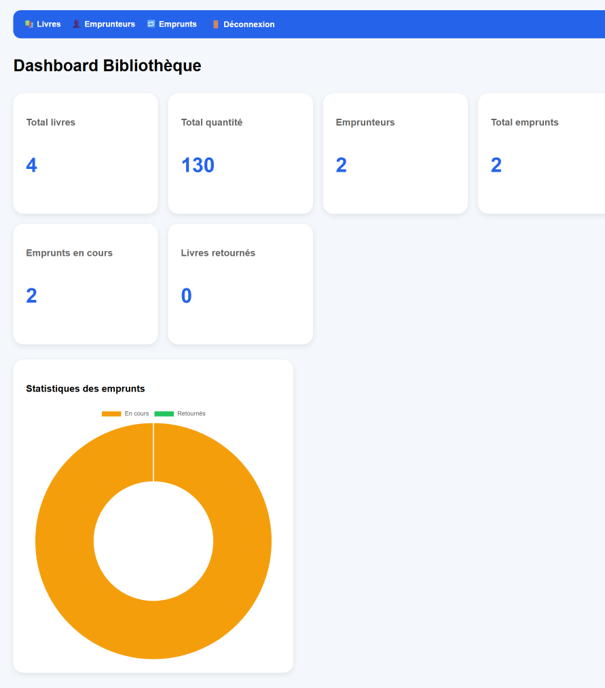
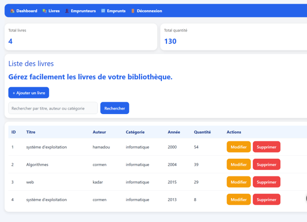
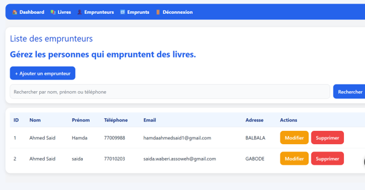
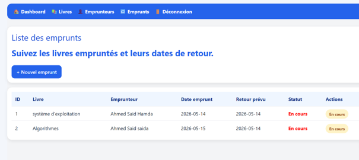

# 📚 Gestion de bibliothèque

Application web de gestion de bibliothèque développée avec **Laravel**.

Ce projet permet de gérer les livres, les emprunteurs et les emprunts à travers une interface web simple et intuitive. Il a été réalisé afin de mettre en pratique mes compétences en développement web, programmation backend, bases de données et utilisation du framework Laravel.

---

## 🎯 Objectif du projet

L'objectif est de proposer une application permettant de centraliser les principales opérations nécessaires à la gestion d'une bibliothèque :

- gestion des livres ;
- gestion des emprunteurs ;
- suivi des emprunts ;
- suivi des retours ;
- consultation des statistiques depuis un tableau de bord.

---

## ✨ Fonctionnalités

### 📖 Gestion des livres

- Ajouter un livre
- Modifier un livre
- Supprimer un livre
- Afficher la liste des livres
- Rechercher un livre par titre, auteur ou catégorie
- Gérer les quantités disponibles

### 👤 Gestion des emprunteurs

- Ajouter un emprunteur
- Modifier ses informations
- Supprimer un emprunteur
- Afficher la liste des emprunteurs
- Rechercher par nom, prénom ou téléphone

### 🔄 Gestion des emprunts

- Enregistrer un nouvel emprunt
- Associer un livre à un emprunteur
- Enregistrer la date d'emprunt
- Gérer la date de retour prévue
- Suivre le statut d'un emprunt
- Enregistrer le retour d'un livre

### 📊 Tableau de bord

Le tableau de bord permet de consulter rapidement :

- le nombre total de livres ;
- la quantité totale disponible ;
- le nombre d'emprunteurs ;
- les emprunts en cours ;
- les livres retournés ;
- les statistiques des emprunts.

### 🔐 Authentification

L'application dispose également d'un système d'authentification permettant de sécuriser l'accès aux fonctionnalités de gestion.

---

## 🛠️ Technologies utilisées

- **PHP**
- **Laravel**
- **Blade**
- **HTML**
- **CSS**
- **JavaScript**
- **Base de données relationnelle**
- **Git**
- **GitHub**

---

## 📸 Captures d'écran

### Tableau de bord



Le tableau de bord présente les principales statistiques de la bibliothèque.

### Gestion des livres



Cette interface permet d'afficher, rechercher, ajouter, modifier et supprimer les livres.

### Gestion des emprunteurs



Cette interface permet de gérer les personnes enregistrées comme emprunteurs.

### Gestion des emprunts



Cette interface permet de suivre les livres empruntés, les emprunteurs, les dates de retour prévues et le statut des emprunts.

---

## ⚙️ Installation

### 1. Cloner le projet

```bash
git clone https://github.com/hamdaahmedsaid1-wq/gestion-bibliotheque-laravel.git
